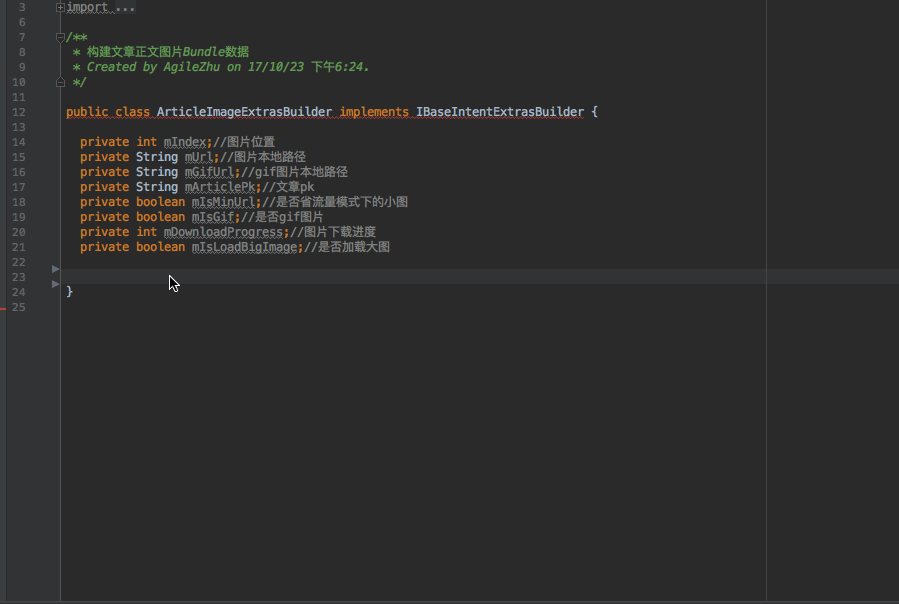

# BundleDataBuilder
## android studio plugin -> [Click Download Plugin](https://github.com/guangdeshishe/BundleDataBuilder/blob/master/BundleDataBuilder.jar)
### help generate [BundleDataBuilder] class code

### 1、define a interface like this:

      import android.os.Bundle;
      
      public interface IBaseIntentExtrasBuilder {
      
        void parse(Bundle bundle);
      
        Bundle build();
      }

### 2、create class implements [step:1] defined interface [IBaseIntentExtrasBuilder]:
    
    public class ArticleImageExtrasBuilder implements IBaseIntentExtrasBuilder {
    
      private int mIndex;//图片位置
      private String mUrl;//图片本地路径
      private String mGifUrl;//gif图片本地路径
      private String mArticlePk;//文章pk
      private boolean mIsMinUrl;//是否省流量模式下的小图
      private boolean mIsGif;//是否gif图片
      private int mDownloadProgress;//图片下载进度
      private boolean mIsLoadBigImage;//是否加载大图
      
    }
### 3、use this BundleDataBuilder Plugin generate other code:

### 4、you can build Bundle data like this:

        ArticleImageExtrasBuilder extrasBuilder = new ArticleImageExtrasBuilder();
        extrasBuilder.setIndex(index);
        extrasBuilder.setUrl(str);
        extrasBuilder.setArticlePk(pk);
        extrasBuilder.setGifUrl(gifUrl);
        extrasBuilder.setIsMinUrl(isMinUrl);
        extrasBuilder.setIsGif(isGif);
        extrasBuilder.setIsLoadBigImage(isLoadBigImage);
        msg.setData(extrasBuilder.build());
        mhandler.sendMessageDelayed(msg, 0);
        
### 5、then you can get Bundle data like this:

      private void initImage(Bundle imageBundle) {
    
        ArticleImageExtrasBuilder imageExtrasBuilder = new ArticleImageExtrasBuilder();
        imageExtrasBuilder.parse(imageBundle);
    
        int index = imageExtrasBuilder.getIndex();
        String url = imageExtrasBuilder.getUrl();
    
        mArticleContentView.currentShowImageIndex = index;
    
        String articlePk = imageExtrasBuilder.getArticlePk();
    
        String gifUrl = imageExtrasBuilder.getGifUrl();
    
        boolean isMinUrl = imageExtrasBuilder.getIsMinUrl();
        boolean isGif = imageExtrasBuilder.getIsGif();
        boolean isLoadBigImage = imageExtrasBuilder.getIsLoadBigImage();
      }